# Configuración y administración de las fuentes de inteligencia artificial aplicada al contenido

Esta guía le explica cómo configurar las fuentes de inteligencia artificial aplicada al contenido en Cloud Manager, desde los requisitos previos de reunión hasta la creación de una fuente de contenido y la confirmación de que está indexada y disponible.

## Requisitos previos {#prerequisites}

Antes de empezar, asegúrese de que se cumplen las siguientes condiciones:

* Tiene un programa de Cloud Manager activo con al menos un entorno de AEM as a Cloud Service.
* El usuario está asignado al perfil de producto **Usuarios de AEM** para el entorno de destino, lo cual le permite ver las fuentes de contenido.
* El usuario está asignado al perfil de producto **Administradores de AEM** para el entorno de destino, lo cual le permite crear y editar orígenes de contenido. El acceso a Cloud Manager por sí solo no es suficiente. Consulte [Asignar un usuario a un perfil de producto de AEM](#assign-product-profile) a continuación.
* El perfil de producto de entorno se ha aprovisionado en **Adobe Admin Console**.

## Asignar un usuario a un perfil de producto de AEM {#assign-product-profile}

Utilice este procedimiento para otorgar acceso a un usuario a [!DNL Adobe Experience Manager] as a Cloud Service para un entorno específico. Asigne el perfil que coincida con el acceso que necesita el usuario:

* **[!UICONTROL Usuarios de AEM]**: vean fuentes de contenido.
* **[!UICONTROL Administradores de AEM]**: cree y edite orígenes de contenido.

>[!NOTE]
>
>Los usuarios deben pertenecer a un perfil de producto de AEM como **[!UICONTROL Usuarios de AEM]** o **[!UICONTROL Administradores de AEM]** para acceder a AEM. El acceso a Cloud Manager por sí solo no es suficiente.

Para asignar estos perfiles, debe ser administrador del sistema con el perfil de producto de Cloud Manager [!UICONTROL Propietario del negocio]. Tenga preparados el nombre y la dirección de correo electrónico del usuario.

1. En [Cloud Manager](https://my.cloudmanager.adobe.com/), vaya a su programa y seleccione **[!UICONTROL Administrar acceso]** para el entorno de destino. Se abre una nueva pestaña [!DNL Adobe Admin Console] para ese entorno.
1. Seleccione el perfil de producto **[!UICONTROL Usuarios de AEM]** o **[!UICONTROL Administradores de AEM]** para el nivel **publicar**; por ejemplo, `AEM Administrators - publish - Program 12345 - Environment 67890`. La inteligencia artificial aplicada al contenido publica contenido, por lo que el perfil debe asignarse al nivel de publicación, no al de autor.
1. Seleccione **[!UICONTROL Agregar usuario]**.
1. Introduzca el nombre y la dirección de correo electrónico del usuario y, a continuación, guarde el cambio. El usuario se agrega al perfil del producto.

Repita estos pasos para cada entorno donde el usuario necesite acceso, como desarrollo, ensayo o producción.

>[!CAUTION]
>
>No edite ni elimine los perfiles de producto predeterminados llamados **[!UICONTROL Administradores de AEM]** o **[!UICONTROL Usuarios de AEM]**. Al cambiar el nombre de **[!UICONTROL Administradores de AEM]** se eliminarán los derechos de administrador de todos los que tengan asignados.

### Comprobar la asignación {#verify-assignment}

Para comprobar que la asignación se ha realizado correctamente:

1. En [!DNL Admin Console], vuelva a abrir el perfil de producto que asignó.
1. Confirme que el usuario aparece en la lista de miembros.

Si está solucionando problemas de acceso o de token, confirme que el usuario se agrega directamente al perfil del producto y no solo a través de un grupo.

## Paso 1: Abrir la pestaña Configuración de inteligencia artificial aplicada al contenido {#open-tab}

1. Inicie sesión en [Cloud Manager](https://my.cloudmanager.adobe.com/) y seleccione su programa.

   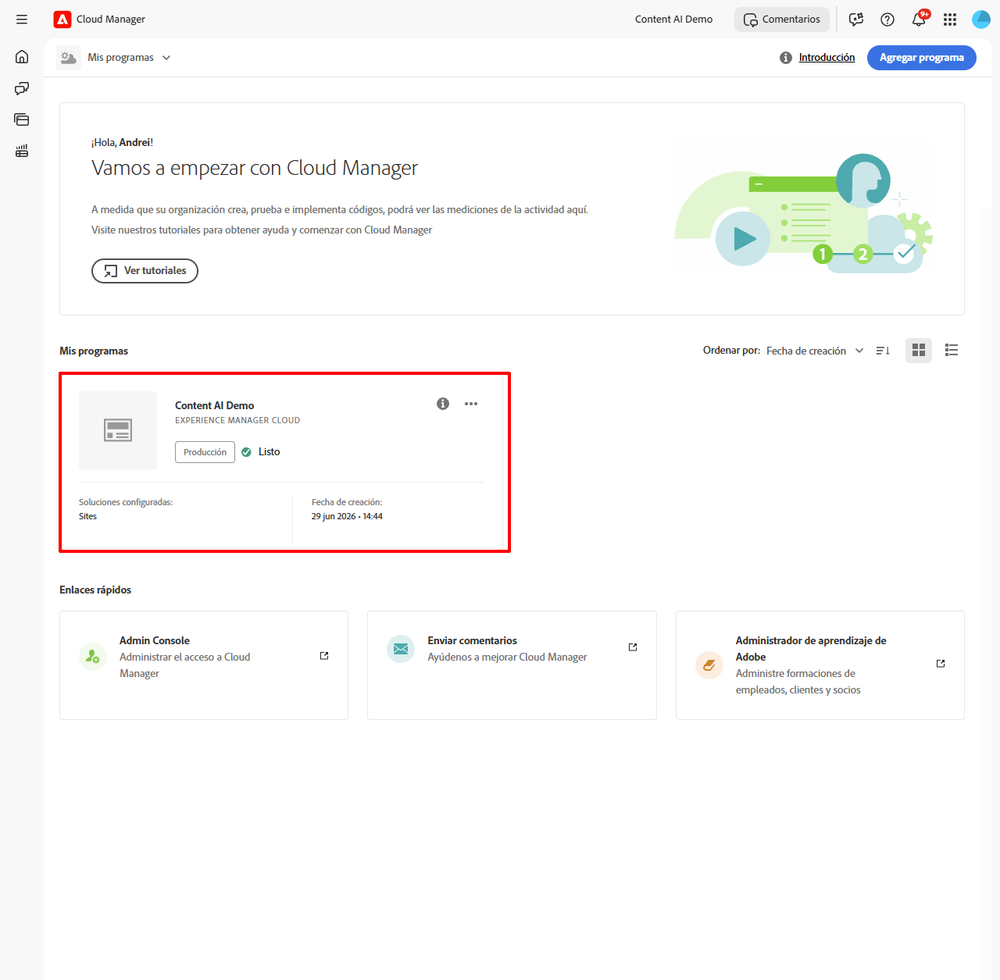

1. En la **[!UICONTROL Descripción general del programa]**, busque la sección **[!UICONTROL Entornos]** y seleccione el entorno que desea configurar.

   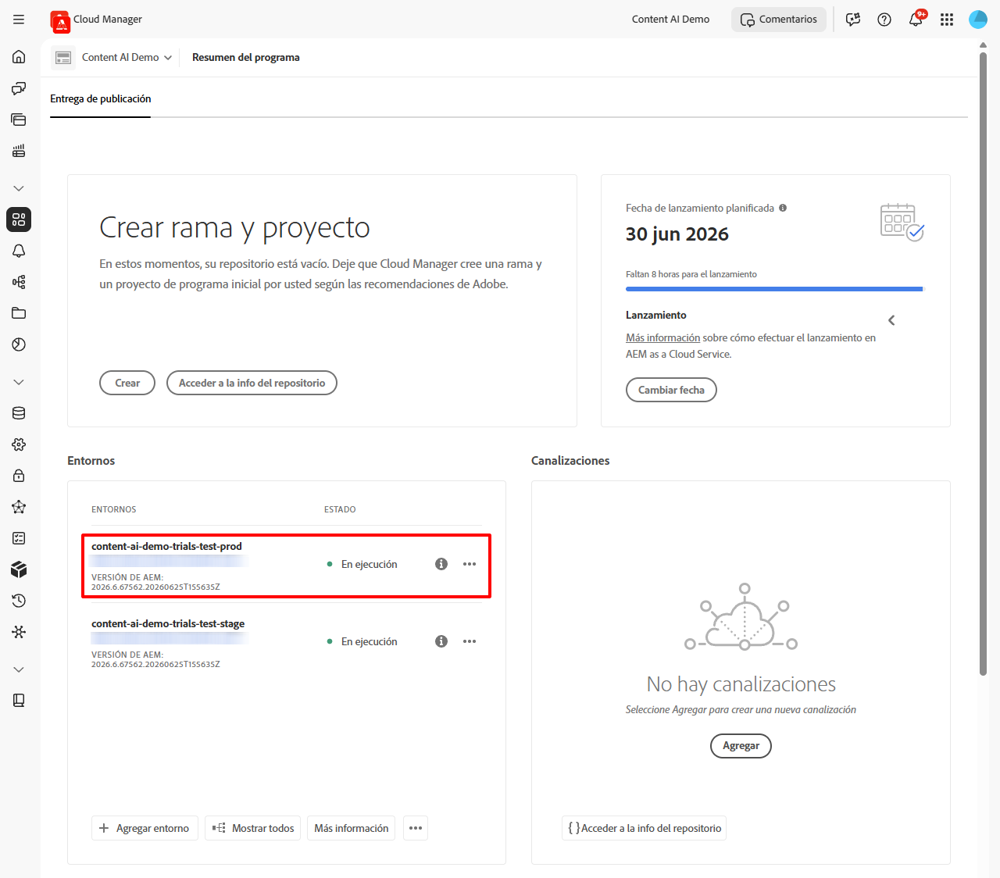

1. En la página de detalles del entorno, seleccione la pestaña **[!UICONTROL Configuración de inteligencia artificial aplicada al contenido]**.

   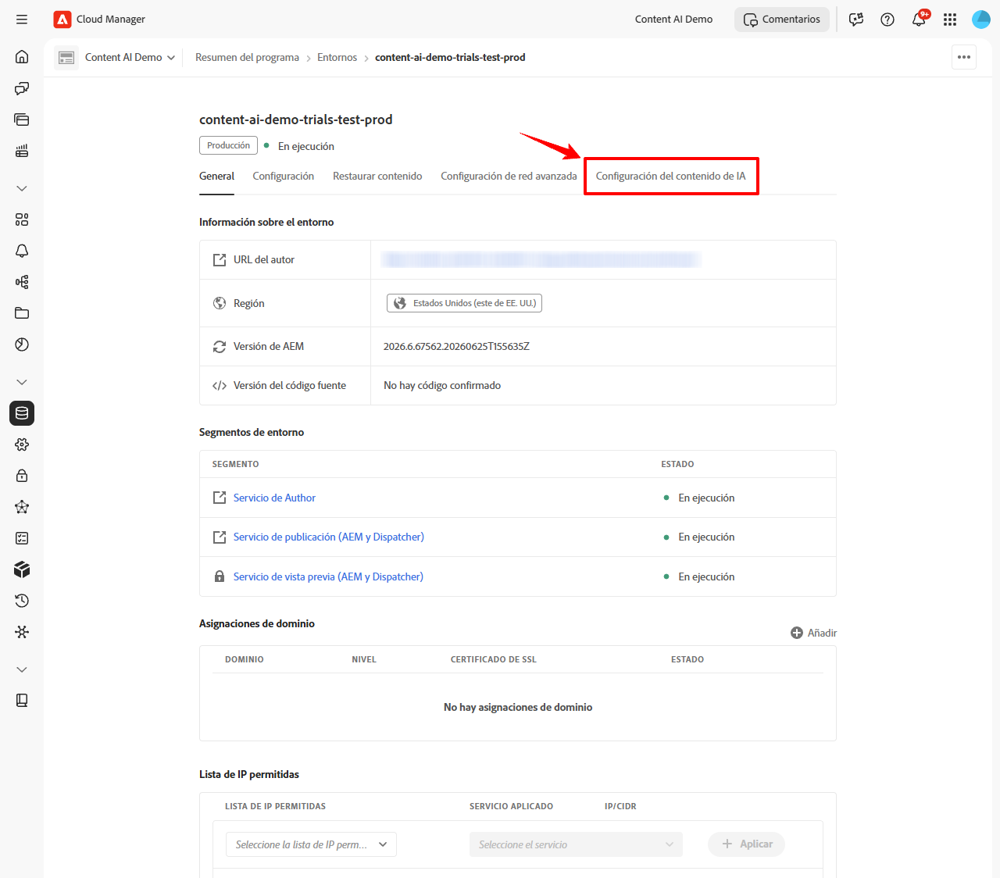

## Paso 2: Creación de una Source de inteligencia artificial aplicada al contenido {#create-source}

Una fuente de contenido define el sitio web que la inteligencia artificial aplicada al contenido rastrea e indexa.

1. En la ficha **[!UICONTROL Configuración de IA de contenido]**, seleccione **[!UICONTROL Crear Source]**.

   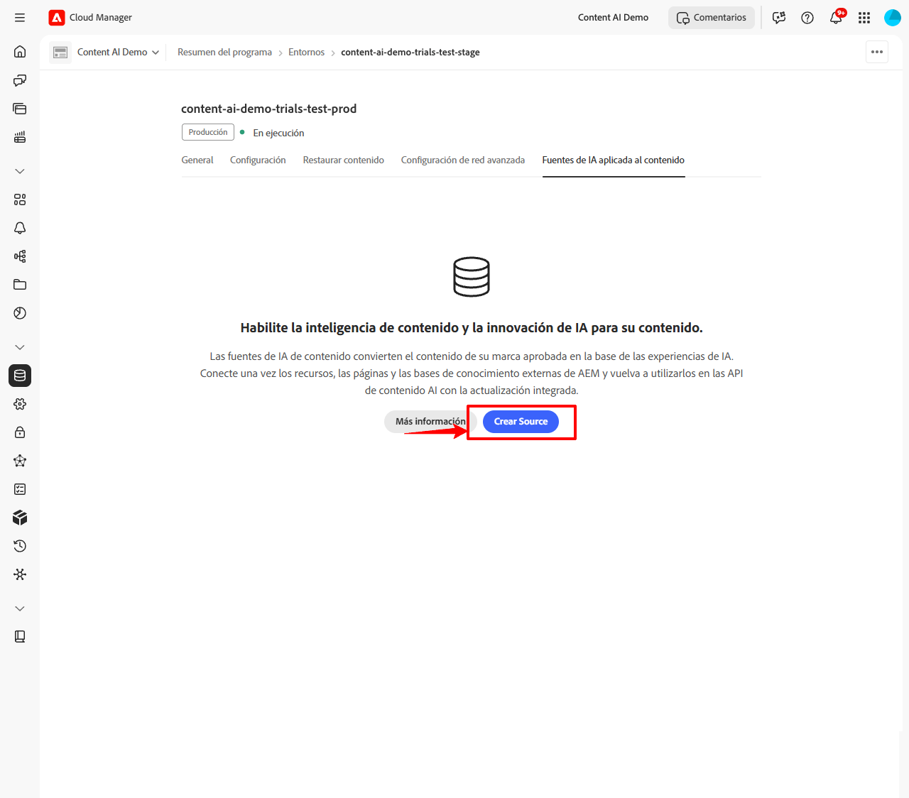

1. En el cuadro de diálogo **[!UICONTROL Crear/agregar nuevo contenido AI Source]**, rellene los campos:

   | Campo | Descripción |
   | --- | --- |
   | **[!UICONTROL Nombre de configuración de IA de contenido]** | Un identificador único para este origen (por ejemplo, `my-site-index`). No se puede cambiar después de la creación. |
   | **[!UICONTROL Descripción]** | *(Opcional)* Breve descripción del origen de contenido. |
   | **[!UICONTROL Dirección de sitio web]** | Dirección URL raíz del sitio web que se va a rastrear (por ejemplo, `https://www.example.com/`). |
   | **[!UICONTROL Excluir direcciones URL]** | *(Opcional)* patrones de URL que se omitirán durante la rastrea. |
   | **[!UICONTROL Frecuencia de actualización]** | La frecuencia con la que la inteligencia artificial aplicada al contenido vuelve a rastrear el origen: Semanal, Diario, Diario 4×, 60 min o 15 min. |

   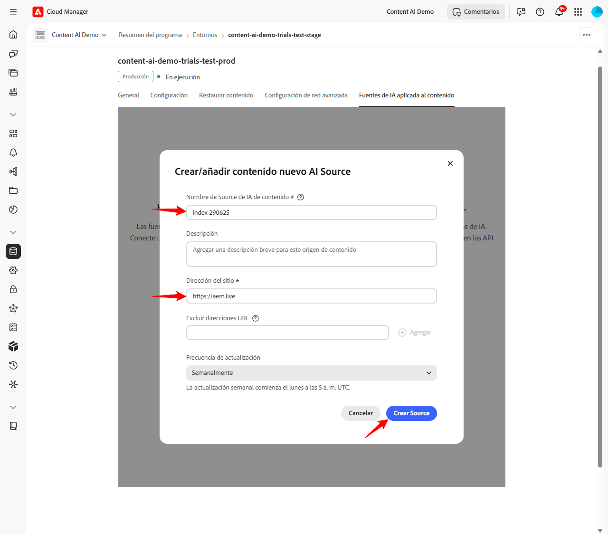

   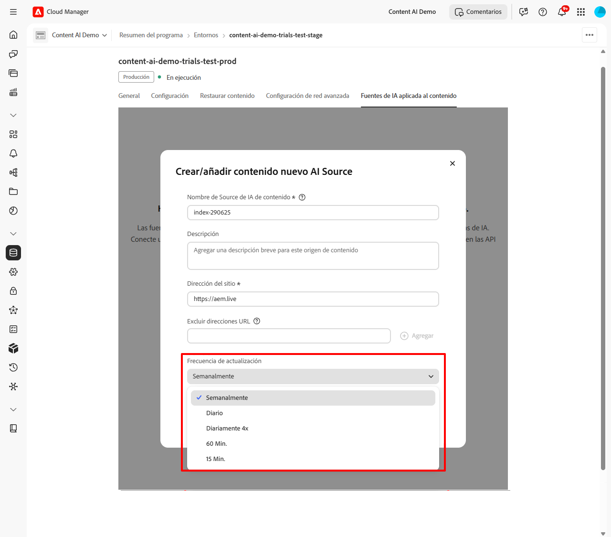

1. Seleccione **[!UICONTROL Crear Source]**.

## Paso 3: Adquisición de Déclencheur {#trigger-acquisition}

Una vez creado el origen, su estado es **Nuevo**. Ejecute una adquisición inicial para iniciar la indexación.

1. En la lista de origen, seleccione el icono **más acciones** (...) junto a su origen y, a continuación, seleccione **[!UICONTROL adquisición de Déclencheur]**.

   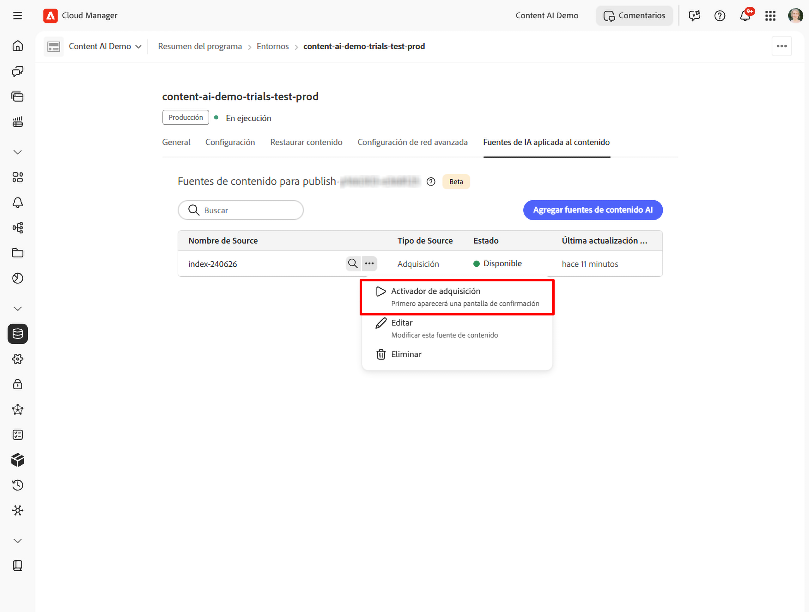

1. En el cuadro de diálogo **[!UICONTROL Adquisición de Déclencheur]**, revise los detalles de origen - **[!UICONTROL Origen de contenido]**, **[!UICONTROL Última ejecución]** y **[!UICONTROL Siguiente ejecución programada]** - y seleccione **[!UICONTROL Déclencheur]**.

   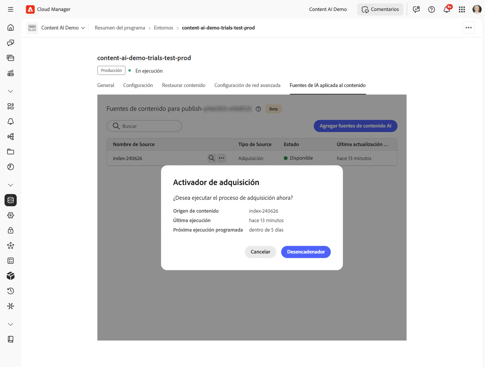

## Paso 4: Monitorización del estado de indexación {#monitor-status}

Después de iniciarse la adquisición, el estado de origen se actualiza en tiempo real.

| Estado | Significado |
| --- | --- |
| **Nuevo** | Source creado; todavía no se ha ejecutado ninguna adquisición. |
| **Indexando** | La adquisición está en curso; el contenido se está rastreando e indexando. |
| **Disponible** | La indización se ha completado; el origen está listo para servir consultas de búsqueda. |

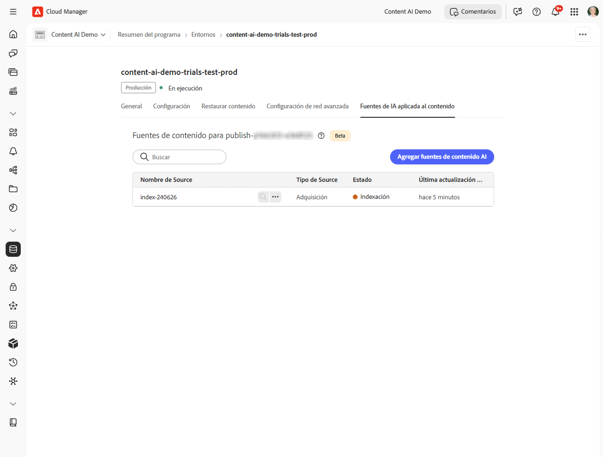

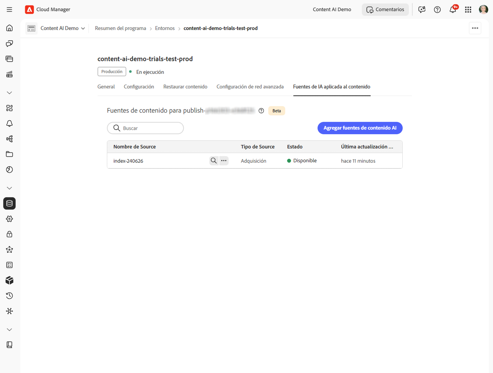

Espere a que el estado alcance **Disponible** antes de buscar en el índice o probar la API.

## Paso 5: Búsqueda de contenido indexado {#search-content}

Una vez que el estado del origen sea **Disponible**, puede ejecutar consultas de búsqueda directamente desde Cloud Manager para comprobar que el contenido se ha indizado correctamente.

1. En la lista de origen, selecciona **[!UICONTROL Buscar]** junto a tu origen.

   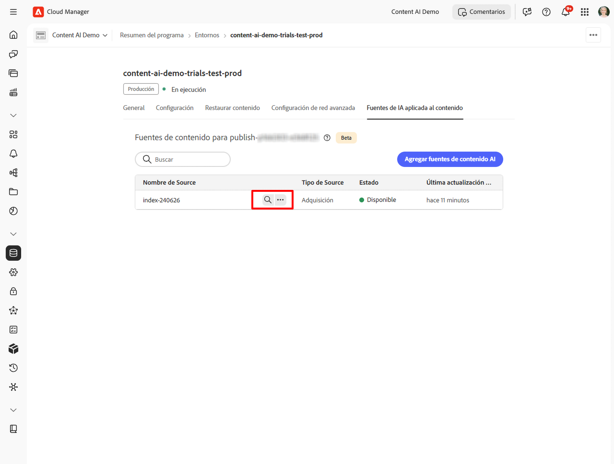

1. Introduzca una consulta en el campo de búsqueda. Los resultados muestran una lista de elementos coincidentes con una puntuación de coincidencia y un tipo de contenido (por ejemplo, **PAGE** o **PDF**). Al seleccionar un resultado, se abre una vista previa a la derecha.

   

## Modificación o eliminación de un Source {#modify-source}

Para actualizar una configuración de origen una vez creada:

1. En la lista de origen, seleccione el icono **más acciones** (...) junto al origen y, a continuación, seleccione **[!UICONTROL Editar]**.

   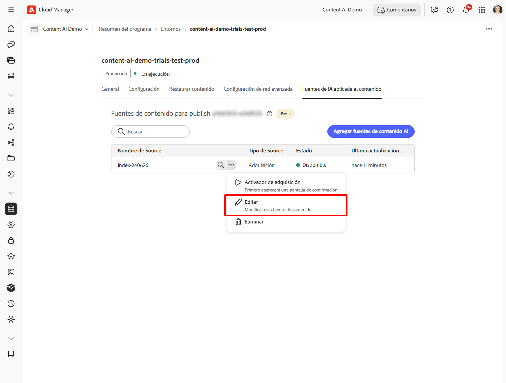

1. En el cuadro de diálogo **[!UICONTROL Modificar la inteligencia artificial aplicada al contenido Source]**, actualice la **[!UICONTROL Descripción]**, la **[!UICONTROL dirección del sitio web]**, **[!UICONTROL Excluir direcciones URL]** o la **[!UICONTROL Frecuencia de actualización]** según sea necesario. El **[!UICONTROL Nombre de configuración de inteligencia artificial aplicada al contenido]** es de solo lectura y no se puede cambiar.

1. Seleccione **[!UICONTROL Guardar]** para aplicar los cambios o seleccione **[!UICONTROL Eliminar]** en la parte inferior izquierda del cuadro de diálogo para quitar el origen por completo.

   >[!WARNING]
   >
   >La eliminación de un origen es permanente. Todo el contenido indizado para ese origen se elimina y ya no puede servir consultas de búsqueda.

   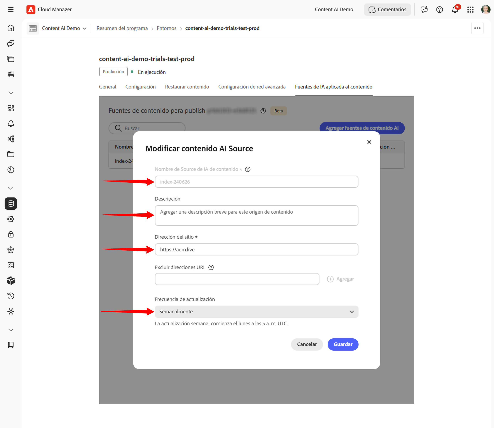

La lista de fuentes se actualiza para reflejar los cambios. Si ha eliminado el origen, ya no aparece en la lista.

## Próximos pasos {#next-steps}

* [Configurar un proyecto de Adobe Developer Console](setup-adc-project.md): cree el proyecto de ADC y las credenciales que necesita para llamar a la API.
* [Referencia de la API de inteligencia artificial aplicada al contenido](https://developer.adobe.com/experience-cloud/experience-manager-apis/api/experimental/contentai/): consulte el contenido indizado mediante extremos de búsqueda semánticos, de texto completo o híbridos.

## Resolución de problemas {#troubleshooting}

* **Source permanece en [!UICONTROL Indexación] durante un período prolongado.** Vuelva a intentar la adquisición desde el menú (...). Si el estado no avanza después de una segunda ejecución, verifica que la **[!UICONTROL dirección del sitio web]** sea de acceso público y que los patrones **[!UICONTROL Excluir direcciones URL]** no filtren todas las páginas.
* **Source vuelve a [!UICONTROL Nuevo] después de una ejecución.** El rastreador no ha podido recuperar ninguna página de la URL raíz configurada. Confirme que la dirección URL responde con `200 OK` y que el sitio no está bloqueando las solicitudes automatizadas.
* **[!UICONTROL La búsqueda] no devuelve resultados para un origen de [!UICONTROL Disponible].** La indexación se ha realizado correctamente, pero ningún contenido coincide con la consulta. Realice una consulta más amplia o compruebe que las direcciones URL rastreadas incluyen las páginas que espera.
