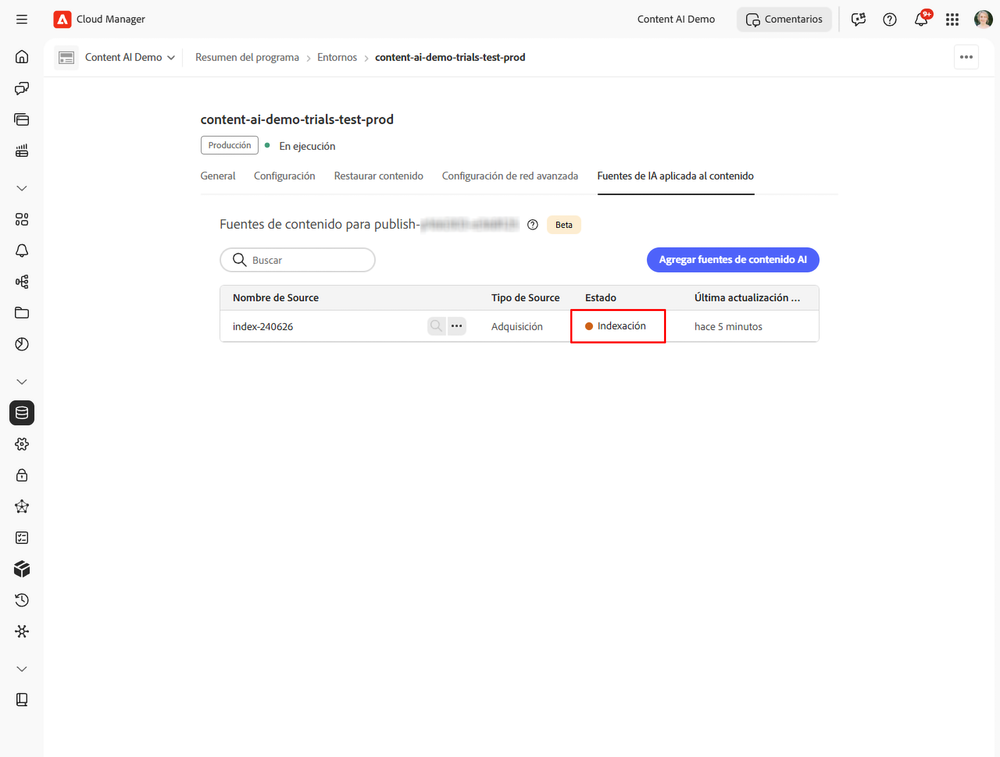

# Configuración y administración de fuentes de la inteligencia artificial aplicada al contenido

Esta guía le explica paso a paso cómo configurar las fuentes de la inteligencia artificial aplicada al contenido en Cloud Manager, desde cumplir los requisitos previos hasta crear una fuente de contenido y confirmar que está indexada y disponible.

## Requisitos previos {#prerequisites}

Antes de empezar, asegúrese de que cumple las siguientes condiciones:

* Dispone de un programa de Cloud Manager activo con al menos un entorno de AEM as a Cloud Service.
* A su usuario se le asigna el perfil de producto **Usuarios de AEM** para el entorno de destino, lo cual le permite ver las fuentes de contenido.
* A su usuario se le asigna el perfil de producto **Administradores de AEM** para el entorno de destino, lo cual le permite crear y editar fuentes de contenido. El acceso a Cloud Manager por sí solo no es suficiente. Consulte la siguiente sección, [Asignar un usuario a un perfil de producto de AEM](#assign-product-profile).
* El perfil de producto de entorno se ha proporcionado en **Adobe Admin Console**.

## Asignar un usuario a un perfil de producto de AEM {#assign-product-profile}

Utilice este procedimiento para otorgar acceso a un usuario a [!DNL Adobe Experience Manager] as a Cloud Service para un entorno específico. Asigne el perfil que coincida con el acceso que necesita el usuario:

* **[!UICONTROL Usuarios de AEM]**: ven las fuentes de contenido.
* **[!UICONTROL Administradores de AEM]**: crean y editan las fuentes de contenido.

>[!NOTE]
>
>Los usuarios deben pertenecer a un perfil de producto de AEM como **[!UICONTROL Usuarios de AEM]** o **[!UICONTROL Administradores de AEM]** para acceder a AEM. El acceso a Cloud Manager por sí solo no es suficiente.

Para asignar estos perfiles, debe ser un administrador del sistema con el perfil de producto [!UICONTROL Business Owner] Cloud Manager. Tenga preparados el nombre y la dirección de correo electrónico del usuario.

1. En [Cloud Manager](https://my.cloudmanager.adobe.com/), vaya a su programa y seleccione **[!UICONTROL Administrar acceso]** para el entorno de destino. Se abre una nueva pestaña [!DNL Adobe Admin Console] para ese entorno.
1. Seleccione el perfil de producto **[!UICONTROL Usuarios de AEM]** o **[!UICONTROL Administradores de AEM]** para el nivel **publicar**; por ejemplo, `AEM Administrators - publish - Program 12345 - Environment 67890`. La inteligencia artificial aplicada al contenido publica contenido, por lo que el perfil debe asignarse a nivel de publicación, no de autor.
1. Seleccione **[!UICONTROL Añadir usuario]**.
1. Introduzca el nombre y la dirección de correo electrónico del usuario y, a continuación, guarde el cambio. El usuario se añade al perfil del producto.

Repita estos pasos para cada entorno al que el usuario necesite acceder, como el de desarrollo, ensayo o producción.

>[!CAUTION]
>
>No edite ni elimine los perfiles de producto llamados **[!UICONTROL Administradores de AEM]** o **[!UICONTROL Usuarios de AEM]**. Al cambiar el nombre de **[!UICONTROL Administradores de AEM]** se eliminarán los derechos de administrador de todas las personas asignadas a dicho grupo.

### Verificación de la asignación {#verify-assignment}

Para verificar que la asignación se ha realizado correctamente:

1. En [!DNL Admin Console], vuelva a abrir el perfil de producto que asignó.
1. Confirme que el usuario aparece en la lista de miembros.

Si está solucionando problemas de acceso o de token, confirme que el usuario se añade directamente al perfil del producto y no solo a través de un grupo.

## Paso 1: abrir la pestaña Configuración de la inteligencia artificial aplicada al contenido {#open-tab}

1. Inicie sesión en [Cloud Manager](https://my.cloudmanager.adobe.com/) y seleccione su programa.

   

1. En **[!UICONTROL Información general sobre el programa]**, busque la sección **[!UICONTROL Entornos]** y seleccione el entorno que desea configurar.

   

1. En la página de detalles del entorno, seleccione la pestaña **[!UICONTROL Configuración de la inteligencia artificial aplicada al contenido]**.

   

## Paso 2: crear una fuente de inteligencia artificial aplicada al contenido {#create-source}

Una fuente de contenido define el sitio web que la inteligencia artificial aplicada al contenido rastrea e indexa.

1. En la pestaña **[!UICONTROL Configuración de la inteligencia artificial aplicada al contenido]**, seleccione **[!UICONTROL Crear fuente]**.

   

1. En el cuadro de diálogo **[!UICONTROL Crear/añadir nueva fuente de inteligencia artificial aplicada al contenido]**, rellene los siguientes campos:

   | Campo | Descripción |
   | --- | --- |
   | **[!UICONTROL Nombre de configuración de la inteligencia artificial aplicada al contenido]** | Un identificador único para esta fuente (por ejemplo, `my-site-index`). No se puede cambiar después de la creación. |
   | **[!UICONTROL Descripción]** | *(Opcional)* Breve descripción de la fuente de contenido. |
   | **[!UICONTROL Dirección del sitio web]** | Dirección URL raíz del sitio web que se va a rastrear (por ejemplo, `https://www.example.com/`). |
   | **[!UICONTROL Excluir URL]** | *(Opcional)* Patrones de URL que se deben omitir durante el rastreo. |
   | **[!UICONTROL Frecuencia de actualización]** | La frecuencia con la que la inteligencia artificial aplicada al contenido vuelve a rastrear la fuente: semanalmente, a diario, a diario 4×, 60 min o 15 min. |

   

   

1. Seleccione **[!UICONTROL Crear fuente]**. La adquisición se inicia automáticamente y la fuente pasa a **Indexación**.

   

## Paso 3: volver a ejecutar la adquisición {#trigger-acquisition}

La adquisición se ejecuta automáticamente cuando se crea una fuente y, a continuación, según la programación establecida por **[!UICONTROL Frecuencia de actualización]**. También puede activar una ejecución manualmente en cualquier momento, por ejemplo, para reindexar inmediatamente después de publicar contenido nuevo.

1. En la lista de fuentes, seleccione el icono **más acciones** (...) junto a la fuente y, a continuación, seleccione **[!UICONTROL Activar adquisición]**.

   

1. En el cuadro de diálogo **[!UICONTROL Activar adquisición]**, revise los detalles de la fuente: **[!UICONTROL Fuente de contenido]**, **[!UICONTROL Última ejecución]** y **[!UICONTROL Siguiente ejecución programada]** y seleccione **[!UICONTROL Activar]**.

   

## Paso 4: Monitorizar del estado de indexación {#monitor-status}

Después de iniciarse la adquisición, el estado de la fuente se actualiza en tiempo real.

| Estado | Significado |
| --- | --- |
| **Nuevo** | La fuente se acaba de crear; la adquisición automática aún no ha comenzado. Este estado es breve. |
| **Indexación** | La adquisición está en curso; el contenido se está rastreando e indexando. |
| **Disponible** | La indexación se ha completado; la fuente está lista para atender consultas de búsqueda. |

Espere a que el estado esté **Dsponible** antes de buscar en el índice o probar la API.

## Paso 5: búsqueda del contenido indexado {#search-content}

Una vez que el estado de la fuente esté **Disponible**, puede ejecutar consultas de búsqueda directamente desde Cloud Manager para comprobar que el contenido se ha indexado correctamente.

1. En la lista de fuentes, seleccione el icono de **búsqueda** (lupa) junto a su fuente.

   

1. Introduzca una consulta en el campo de búsqueda. Los resultados muestran una lista de elementos coincidentes con una puntuación de coincidencia y un tipo de contenido (por ejemplo, **PÁGINA** o **PDF**). Al seleccionar un resultado, se abre una vista previa a la derecha.

   

## Modificar o eliminar una fuente {#modify-source}

### Modificar una fuente {#modify}

Para actualizar una configuración de la fuente una vez creada:

1. En la lista de fuentes, seleccione el icono de **más acciones** (...) situado junto a la fuente y, a continuación, seleccione **[!UICONTROL Editar]**.

   

1. En el cuadro de diálogo **[!UICONTROL Modificar fuente de la inteligencia artificial aplicada al contenido]**, actualice la **[!UICONTROL Descripción]**, **[!UICONTROL Dirección del sitio web]**, **[!UICONTROL Excluir direcciones URL]** o **[!UICONTROL Frecuencia de actualización]** según sea necesario. El **[!UICONTROL Nombre de configuración de la inteligencia artificial aplicada al contenido]** es de solo lectura y no se puede cambiar.

   

1. Seleccione **[!UICONTROL Guardar]** para aplicar los cambios. La lista de fuentes se actualiza para reflejar los cambios.

### Eliminar una fuente {#delete}

1. En la lista de fuentes, seleccione el icono de **más acciones** (...) situado junto a la fuente y, a continuación, seleccione **[!UICONTROL Eliminar]**.

   >[!WARNING]
   >
   >La eliminación de una fuente es permanente. Todo el contenido indexado para esa fuente se elimina y ya no puede atender consultas de búsqueda.

Después de la eliminación, la fuente ya no aparecerá en la lista.

## Próximos pasos {#next-steps}

* [Configuración de un proyecto de Adobe Developer Console](setup-adc-project.md): cree el proyecto de ADC y las credenciales necesarias para llamar a la API.
* [Referencia de API de la inteligencia artificial aplicada al contenido](https://developer.adobe.com/experience-cloud/experience-manager-apis/api/experimental/contentai/): realice consultas del contenido indexado mediante puntos finales de búsqueda semántica, de texto completo o híbrida.

## Resolución de problemas {#troubleshooting}

* **La fuente permanece en [!UICONTROL Indexación] durante un período prolongado.** Vuelva a intentar la adquisición desde el menú (...). Si el estado no avanza después de una segunda ejecución, verifique que la **[!UICONTROL Dirección del sitio web]** sea de acceso público y que los patrones **[!UICONTROL Excluir direcciones URL]** no filtren todas las páginas.
* **La fuente vuelve a [!UICONTROL Nuevo] después de una ejecución.** El rastreador no ha podido recuperar ninguna página de la URL raíz configurada. Confirme que la dirección URL responde con `200 OK` y que el sitio no está bloqueando las solicitudes automatizadas.
* **[!UICONTROL La búsqueda] no devuelve resultados para una fuente [!UICONTROL Disponible].** La indexación se ha realizado correctamente, pero ningún contenido coincide con la consulta. Realice una consulta más amplia o compruebe que las direcciones URL rastreadas incluyen las páginas que espera.
