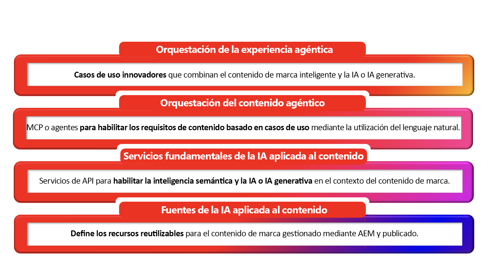

# AI de contenido de AEM: introducción

## Contenido inteligente, listo para IA por diseño {#ai-ready}

Los clientes están empezando a conocer marcas a través de IA antes de conocer un sitio web. Asistentes de chat, descripciones generales de IA, agentes, búsqueda conversacional, conserjes de IA: todos recuperan, resumen y representan el contenido de la marca en nombre de la misma. Lo que dicen es tan preciso, actual y en la marca como el contenido al que pueden llegar.
Ese es el cambio para el que está diseñada la IA del contenido de AEM. Trata el contenido de la marca como la verdad básica en la que se ejecutan las experiencias de IA y proporciona a los clientes de AEM las herramientas para crear esa verdad básica más rápido en el lado del autor y ofrecerla claramente a las experiencias impulsadas por IA del lado del consumidor en el lado de la publicación.

**Del lado del autor**, la inteligencia artificial aplicada al contenido de AEM basa la creación en fuentes de marca aprobadas. La creación asistida por IA, el descubrimiento en lenguaje natural de contenido de páginas existentes, fragmentos y recursos y la generación con reconocimiento de marca permiten a los equipos producir variaciones para nuevas audiencias, regiones y canales sin salir de AEM y sin alejarse de lo que ya se ha aprobado.

**En el lado de la publicación**, el mismo contenido está estructurado, controlado y direccionable para que la inteligencia artificial lo consuma. Los fragmentos, los metadatos, las taxonomías y las fuentes aprobadas se exponen de formas que los sistemas de recuperación, los agentes y las interfaces conversacionales pueden utilizar con confianza, por lo que, cuando la IA habla en nombre de la marca, habla de la verdad de la marca.

### Qué significa para los clientes de AEM {#what-it-means}

El contenido aprobado es la defensa de la marca contra las alucinaciones. Cuando la IA se basa en contenido de AEM controlado, las respuestas siguen siendo precisas, actuales y no dependen de la marca de forma predeterminada.
La creación sigue el ritmo de la demanda de la era de la IA. Los equipos generan copias e imágenes para más audiencias y momentos dentro de la experiencia de creación, dibujando a partir de fuentes aprobadas en lugar de empezar en blanco.
El descubrimiento funciona de la manera en que la gente y las máquinas preguntan. La búsqueda en lenguaje natural y basada en intención en recursos, fragmentos, páginas y formularios convierte el contenido existente en un suministro reutilizable.
Personalization se adapta mediante la reutilización, no la duplicación. Los componentes gobernados se recombinan en variantes en lugar de multiplicarse en copias sin seguimiento.
Los canales de publicación ahora incluyen superficies de IA. El contenido se entrega en formas que los seres humanos, los agentes y las experiencias mediadas por IA pueden consumir, sin canalizaciones independientes para cada uno.

**El punto más importante: el contenido de marca de confianza existente es más valioso ahora que nunca. Cada fragmento, recurso y página aprobados que ya viven en AEM se convierte en la verdad básica de la que dependen las experiencias impulsadas por IA, y la IA del contenido de AEM es lo que hace que esa biblioteca sea reutilizable, detectable y lista para impulsar lo que viene después.**

## Generalidades de la IA de contenido de AEM {#at-a-glance}

La IA del contenido de AEM está estructurada como una pila de cuatro capas: cada capa se basa en la de abajo, desde el contenido de confianza en la base hasta las experiencias auténticas que potencia en la parte superior.

*Lea la pila de abajo hacia arriba, desde el contenido de confianza en la base hasta las experiencias auténticas que enciende en la parte superior.*

1. Fuentes de IA aplicada al contenido
Las fuentes de contenido son entidades administradas en la IA de contenido de AEM que se conectan a un cuerpo de contenido de confianza. Un Source de contenido puede hacer referencia a un tipo de contenido controlado por AEM, como recursos, fragmentos de contenido, páginas, formularios, metadatos y taxonomías, así como fuentes que no sean de AEM, como sitios web de terceros, bases de conocimiento o portales de documentación. Cada Source de contenido se vectoriza automáticamente y se enriquece semánticamente para potenciar la recuperación, la puesta en tierra y las experiencias de IA conversacional. Defina las fuentes de contenido una vez y reutilícelas en las API de inteligencia artificial aplicada al contenido con la actualización y la actualización automáticas integradas.

1. Content AI Foundation Services
Las API y los servicios que habilitan la inteligencia semántica y la IA generativa en el contexto del contenido de la marca. Además de las fuentes de inteligencia artificial aplicada al contenido, estos servicios permiten la recuperación, la generación, la variación según la marca y la optimización, todo ello basado en el contenido aprobado del cliente.

1. Orquestación de contenido agéntica
MCP y agentes que convierten los requisitos de contenido basados en casos de uso en una acción coordinada a través del lenguaje natural. Esta capa permite a los autores y otros agentes describir lo que necesitan en lenguaje sencillo y tener los servicios fundacionales adecuados organizados para cumplirlo.

1. Orquestación de experiencia agéntica
Los casos de uso innovadores que surgen cuando el contenido inteligente de la marca se encuentra con la IA a escala. Las propias soluciones de AEM se basan en estos servicios básicos, y los clientes pueden utilizar las mismas API directamente para crear sus propias experiencias reales sobre su propio contenido. Desde cadenas de suministro de contenido con tecnología de IA hasta recorridos de usuario conversacionales, en este nivel es donde el contenido controlado se convierte en una ventaja competitiva.

Estas capas están conectadas por diseño: cada servicio de IA extrae de la base del contenido y todo lo producido vuelve al mismo sistema gobernado, por lo que la creación del lado del autor y la entrega del lado de la publicación comparten una fuente de verdad.

## AEM Content AI en acción {#action}

Trabajar en la integración de la inteligencia artificial aplicada al contenido implica dos tareas:

### &#x200B;1. Habilitar la IA de contenido para su entorno de AEM {#enable}

**Requisito previo:** Antes de empezar a usar la inteligencia artificial aplicada al contenido, necesita credenciales de API con alcance para su entorno de AEM as a Cloud Service. Consulte [Configurar un proyecto de Adobe Developer Console](setup-adc-project.md).

### &#x200B;2. Control de las fuentes de inteligencia artificial aplicada al contenido {#control}

Configura y administra tus fuentes de inteligencia artificial aplicada al contenido para habilitar las experiencias basadas en IA. Consulta [Controlar tus fuentes de contenido](contentsources.md) para obtener más información.

## Obtenga información sobre las API de inteligencia artificial aplicada al contenido  {#apis}

Explore la amplitud funcional de la IA de contenido de AEM: las API muestran todo el potencial de la plataforma. Ver [API de IA de contenido](https://developer.adobe.com/experience-cloud/experience-manager-apis/api/experimental/contentai/).
